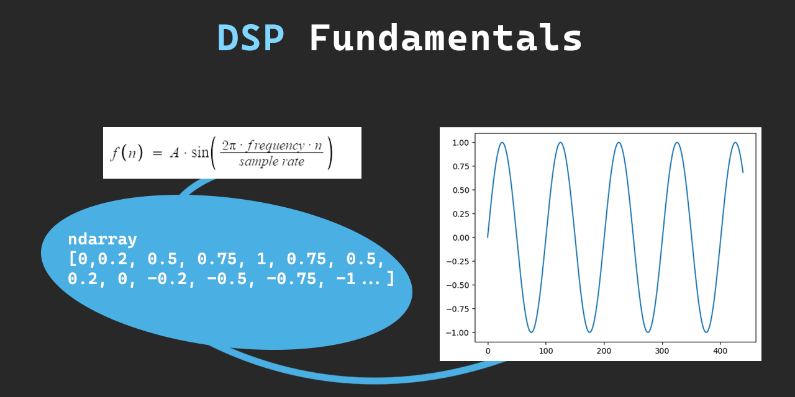

# DSP-Fundamentals

All your DSP questions explained in jupyter notebooks

  

---

## Chapter 1

Getting to know digital audio

-   [Create Sine Waves](<Chapter1_(DigitalAudio)/SineWave.ipynb>)

## Chapter 2

Using math and some programming tricks to shape an audio signal

-   [Wave Shaping](<Chapter2_(WaveShaping)/>)

---
